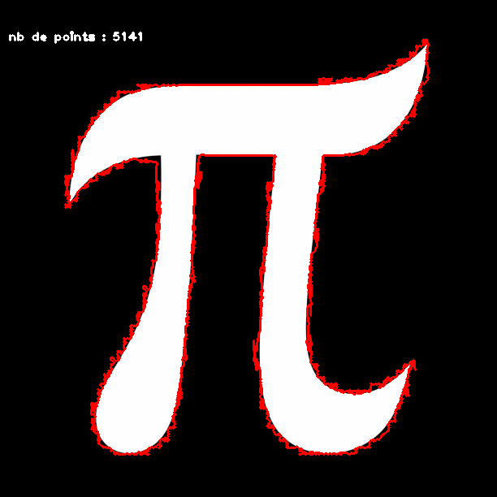
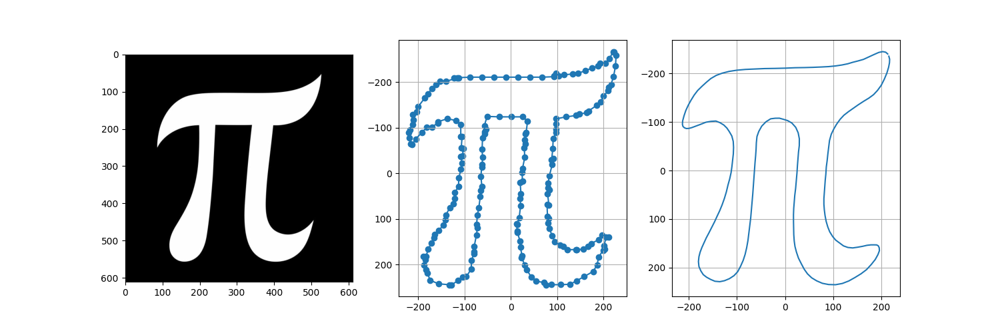
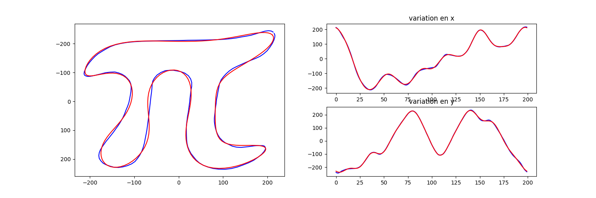

# EpicyclesFourier

Code pour dessiner les épicycles de Fourier. 

# le module contours.py. 

Ce module permet de rechercher le contour de l'objet d'une image. Il contient la classe mère Contours. 

OpenCV permet de trouver ce contour après une légère transformation de l'image :
l'image doit être binaire (noir ou blanc et non pas en variation de gris). 
l'objet doit être blanc sur un fond noir. 

Si l'on affiche le contour sur l'image, on observe cela :

D'une part le contour présente beaucoup de points ce qui ralentira le temps de calcul des coeficients de Fourier et, d'autre part, le contour n'est pas lisse. 

Le module `contours.py` va interpoler le contour de manière à lui donner un nombre de points plus petit (ici 200) avec la fonction `np.interp` et lisser la courbe avec la méthode `signal de scipy`. 

# Le module epicycles.py. 

La classe Epicycle hérite de Contours, on peux donc lancer le programme directement par ce module. 

Ce programme calcule les coeficients de Fourier nécessaires aux épicyles puis lance l'animation matplotlib. 

En changeant l'ordre, c'est-à-dire le nombre de coeficients, on risque de trop lisser la courbe résultante. 

A essayer avec un ordre plus petit (ex 3). 

