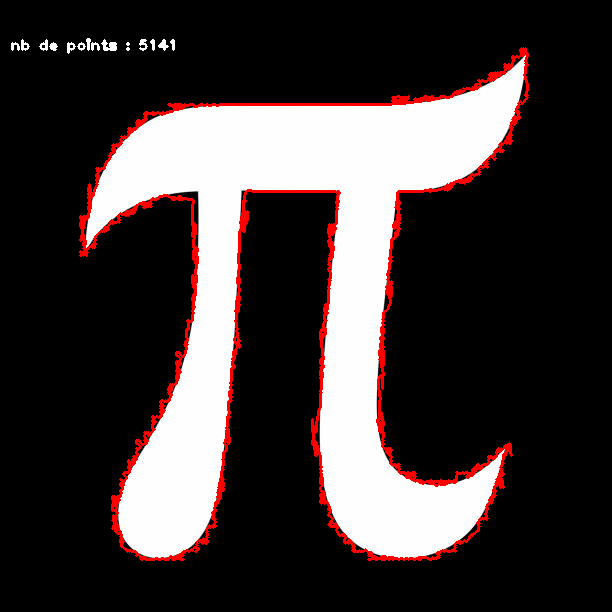
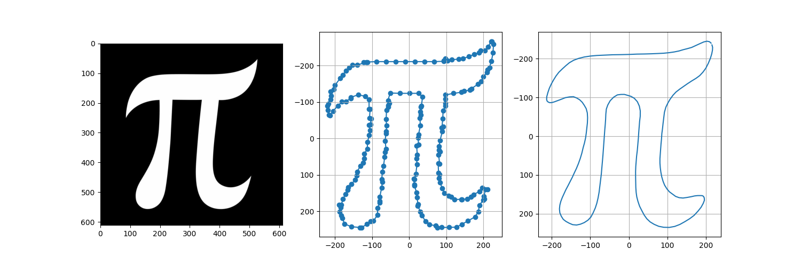
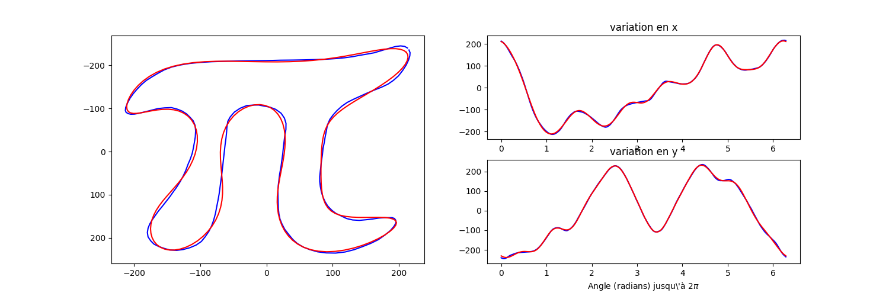

# EpicyclesFourier

Code pour dessiner les épicycles de Fourier et implémenter les transformées de Fourier en Python. 

Ce repo ne présente que le code pour implémenter diverses approches des transformées de Fourier en utilisant les modules scipy et numpy. 

Il ne reprend aucun rappel mathématique. 

### LE README PRESENTE ICI COMPORTE DES ANIMATIONS GIF. MERCI DE PATIENTER SON CHARGEMENT, CELA PEUX PRENDRE QUELQUES SECONDES ###

# installation. 

Dans un environnement virtuel :  

`pip install opencv-python matplotlib scipy`

# le module contours.py. 

Ce module permet de rechercher le contour de l'objet d'une image. Il contient la classe mère Contours. 

OpenCV permet de trouver ce contour après une légère transformation de l'image :
l'image doit être binaire (noir ou blanc et non pas en variation de gris). 
l'objet doit être blanc sur un fond noir. 

Si l'on affiche le contour sur l'image, on observe cela :

D'une part le contour présente beaucoup de points ce qui ralentira le temps de calcul des coeficients de Fourier et, d'autre part, le contour n'est pas lisse. 

Le module `contours.py` va interpoler le contour de manière à lui donner un nombre de points plus petit (ici 200) avec la fonction `np.interp` et lisser la courbe avec la méthode `signal de scipy`. 

# Le module epicycles.py. 

La classe Epicycle hérite de Contours, on peux donc lancer le programme directement par ce module. 

Ce programme calcule les coeficients de Fourier nécessaires aux épicyles puis lance l'animation matplotlib. 

Pour calculer ces coeficients, il faut préalablement décomposer les coordonnées x et y des points du contours. 

En changeant l'ordre, c'est-à-dire le nombre de coeficients, on risque de trop lisser la courbe résultante. 

A essayer avec un ordre plus petit (ex 3). 

Le programme lance ensuite l'animation matplotlib pour observer les épicycles. 

# Utiliser une FFT : le module transformeeFourier.py

Si l'objectif du programme est d'approcher mathématiquement le contour, la Fast Fourier Transform (FFT) est plus appropriée car beaucoup plus rapide dans le calcul des coeficients. 

Pour calculer une FFT, scipy propose la méthode fft pour calculer les coeficients de Fourier et ifft pour calculer l'inverse et donc récupérer la courbe à partir des coeficients calculés. 

Les coeficients calculés sont des nombres complexes. On peut alors afficher leurs amplitudes et proposer un seuil sous lequel tous les coeficients seront nuls. 

Avec autant de coeficients que de points, la courbe résultante est parfaitement collée à la courbe originale. 

Pour autant, avec moins de coeficients (jusqu'à une ceraine limite), la courbe résultante est toujours représentative de la courbe originale. 

# Utiliser une 2D-DFT sur des images : le module imageFourier.py. 

Ce type de modélisation est très utilisée en traitement d'image. Elle permet de calculer la transformée de Fourier sur une matrice. 

L'image a fournir est donc une image en noir et blanc. 

Dans notre cas, l'image ne contient que des pixels noirs ou des pixels blancs. 

En appliquant une 2D-DFT, fournie par OpenCv, on calcule l'image spectrale, représentée ici en 3D qui est la représentation des amplitudes des coeficients de Fourier trouvés. 

On applique alors un masque, représenté par un rectangle noir, d'une dimension donnée, où tous les coeficients en dehors de ce masque seront nuls. 

Si le masque est aussi grand que l'image :

Si le masque est deux fois plus petit :

Si le masque est 10 fois plus petit :

# A quoi ca sert ?  

En reduisant le nombre de coefficients, on lisse la courbe. 

Pour reduire le nombre de coefficients on calcule leurs amplitudes et on mets a zero ceux dont l'amplitude est inférieur a un certain seuil. 

Avec ce nombre reduit de coefficients on calcule l'inverse. 

et on retrouve la courbe ou l'image avec beaucoup moins de donnees qu'avec la donnée originale. 

C'est l'algorithme qui est employe pour compresser des fichiers. 

Limage jpeg est construite comme cela : en effet si l'on zoume sur l'arriere plan d'une image jpeg on s'apercevra du meme flou que notre image du nombre pi. 

# L'interet des eipcyclea. 

Outre le fait de publier des videoa sur Youtube si l'on affiche le résultat de la transformee en 3D on s'apercoit que l'image eat cree par un ensemble de courbes oscillantes :une pour chaque rangee de pixela. 

ces c

