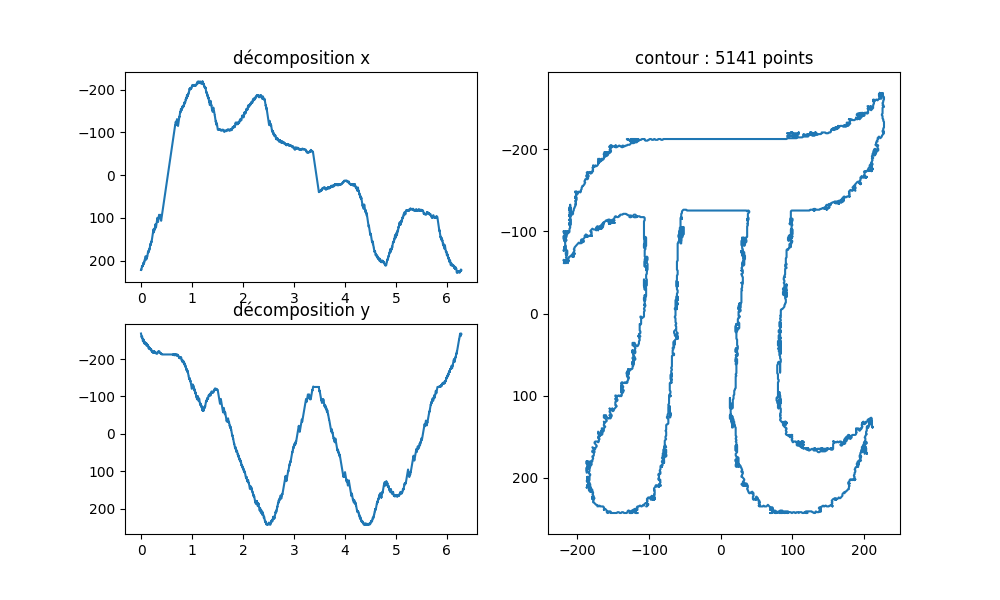
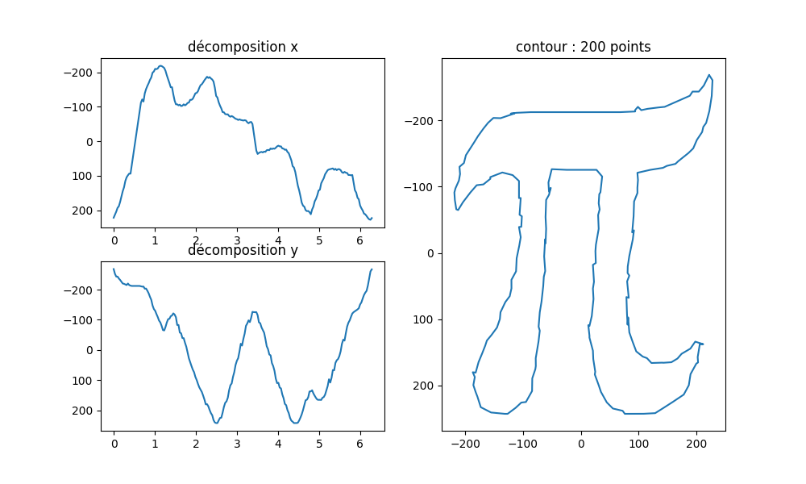
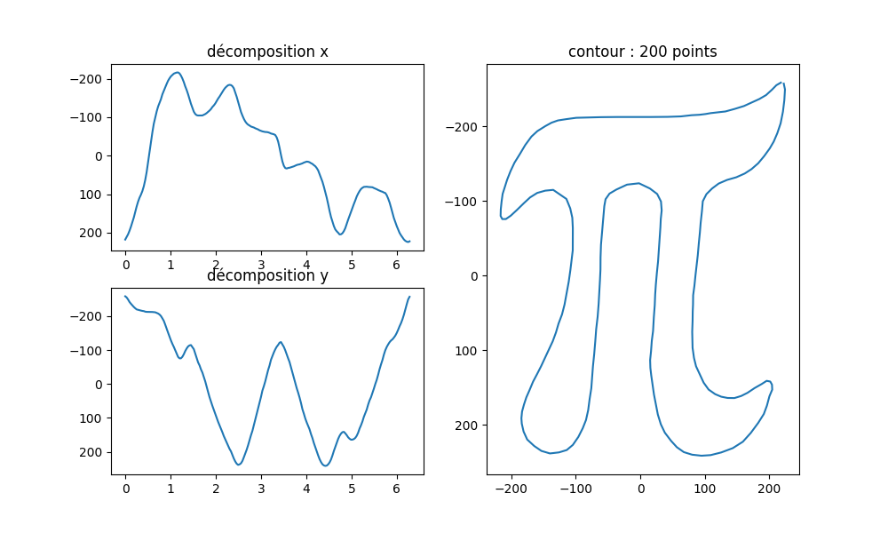
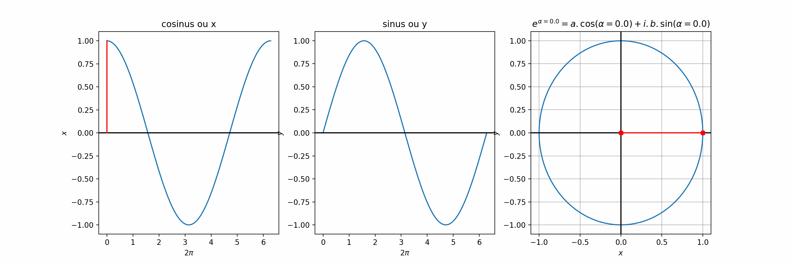

# Code pour utiliser les transformées de Fourier en Python. 

Ce repo contient les codes pour utiliser différents codes proposés par les bibliothèques Python telles que numpy, scipy et opencv afin de calculer les transformées de Fourier sur un contour. 

Sur environnement virtuel :  

`pip install opencv-python matplotlib scipy symfit`

Pour les tests :

`python3 -m unittest discover Tests`

# le module principal : showContour.py. 

Ce module utilise ceux présents dans le dossier `Contour` pour afficher sous matplotlib le résultat des différents modules. 

`python3 showContour.py Pictures/pi.jpg`

# Le dossier Contour. 

Ce dossier contient les modules permettant :  

- d'extraire un contour pour le module `getContour.py`. 
- d'interpoler ce contour pour le module `ìnterpolate.py`. 
- de lisser ce contour pour le module `lissage.py`. 

## le module getContour.py

Le module `getContour.py` prend en entrée le chemin d'une image, ici l'image de pi située dans le dossier `Pictures`. 
Il recherche le contour le plus grand dans cette image après lecture de celle-ci en noir et blanc. 
Il est important que l'objet à analyser ai le plus grand des contours dans l'image. 
L'objet doit être blanc sur un fond noir. 
Il décompose ensuite ce contour en x et en y par rapport au centre du contour. 

On remarque que le contour présente plus de 5000 points, ce qui peut ralentir les calculs des transformées de Fourier. 

## le module interolate.py. 

Ce module permet de donner un nombre plus petit (ou plus grand) de points dans le contour. 
Par défaut, on donne 200 points, ce qui donne des temps de calculs résonnables tout en ayant un nombre de points suffisant pour garder la forme.

## le module liss.py. 

ce module permet de lisser un contour. 

meme si les tramsformees de Fourier lissent elles aussi les contours 

ce lissage préalable aide a la compréhension de la décomposition des coordonnées. 

## le module lissage.py. 

Ce module permet de lisser la courbe. 
L'ordre va lisser plus ou moins cette courbe, il faut trouver une valeur qui ne lisse pas trop et qui soit bien représentative de la forme. 
Le fait de lisser un contour va permettre de faciliter l'analyse de ce dernier en enlevant le bruit. 

### A la fin du programme, les coordonnées x et y sont sauvées dans un fichier `.npy` 

# le dossier Complex. 

Ce dossier permet de comprendre les mathématiques liées aux tranformées de Fourier. 

Les transformées de Fourier utilise les nombres complexes. 

Le module `circleTrigo.py` permet de réaliser cette animation qui représente ce qu'est un nombre complexe. 

Un cercle est composé de 2 courbes : cosinus pour la variation en x et sinus pour la variation en y. 

Un nombre complexe est représenté par :  

- sa partie réelle (x). 
- sa partie imaginaire (y). 

En Python, on déclare un nombre complexe par : p = a + j b. 

et se décompose par :  

p.real = a. 

p.imag = b. 

On peut considérer que l'on fait un tour du contour. 

Si le contour est uh cercle parfait alors a = b. 

Si a est différent de b alors le contour est ovale. 

Un nombre complexe est un vecteur de coordonnées `[real, imag]`. 

Comme tout vecteur, il est caractérisé par :

- son angle : 

- son amplitude :

## le module symfitFourier.py. 

Ce module permet de calculer les coeficients a et b sur une donnée quelconque. 

Nous l'utiliserons pour comprendre une série de Fourier 1D. 

